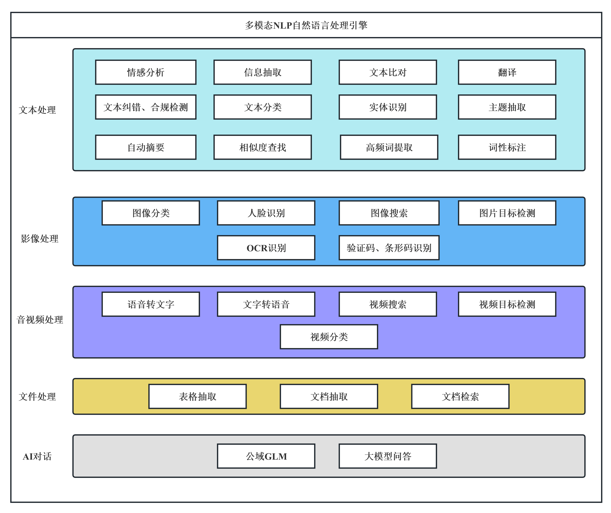

支持本地化部署，欢迎在线体验。

[https://nlp.stonedt.com ](https://nlp.stonedt.com)  

 
应用场景集合，AI算法商城，用户可在线体验

### [https://aistore.stonedt.com ](https://aistore.stonedt.com)  

 
有任何问题请联系 产品负责人：javabloger (微信)
 

   
微信群二维码
  
目前微信群已超200人，只能通过添加产品负责人微信进群。

  
无论你是使用者还是共同完善的开发者，欢迎 pull request 或者 留言对我们提出建议。 
 
您的支持和参与就是我们坚持开源的动力！请 :star:  [star]  或者 [fork] 

如果您在使用过程中有任何问题，请让我们知道，您的使用与反馈对我们非常重要：**

## 产品简介

思通数科利用自然语言处理技术，让计算机具备对网页、文件、文本、声音、图像的阅读能力，帮助客户自动化处理海量文本数据，打造一系列NLP技术工具集或场景化方案，提升文字处理效率和文本挖掘深度，降低人工成本。

同时可做到定制化，本地部署、低成本、接入快速、将网页、文件、文本、声音、图像中的文本进行结构化的处理，支持通过文本挖掘技术实现内容标签提取、文本自动分类等功能，全方位构建企业级数据库与内容画像。

 **支持企业级用户与涉密单位本地化部署。** 

## 系统架构

## 算法模型

## 应用服务

本项目产品使用到的应用服务器以及对应的应用场景及用途整理如下：

|  名称 |  类别 |  应用模块及用途 | 版本  |
|---|---|---|---|
| tomcat  | web服务器  | 提供用户前端页面访问  | 8.5.2  |
| minio |  分布式文件存储 | 1.文件搜索; 2.以图识图源文件存储  |  2.1.3 |

## 功能架构

## 网络拓扑

## 产品体验 
接口地址：https://nlp.stonedt.com  

微信扫码登录，直接体验产品。

 

 

## 安装视频

简易版部署视频链接地址：[https://www.bilibili.com/video/BV1E84y1D7Yg/](https://www.bilibili.com/video/BV1E84y1D7Yg/)

全服务本地化部署视频链接地址： https://www.bilibili.com/video/BV1Vj411t7KV/

## 接口文档

##### 文档地址
https://docs.qq.com/doc/DQU5yQU92aW1jWWJ4

 

## 功能清单

##### 功能列表

https://docs.qq.com/sheet/DQWRvaUJ0R2FGcFVu?tab=hienxw

 

## 应用场景

##### 1）自动结构化数据

应用于深度挖掘文本、音视频、图像、办公文件中的高频词、人物、价格、甲乙方、指标参数、时间、地名、企业名称、专有名词、主题、热点、话题、正负面情感等，自动对其打上数据标签等功能，将企业原有历史沉淀海量无序的内容结构化处理，实现更精准的检索、分类、搜索、推荐能力。系统标签覆盖上百个大类、过万个小类，通用场景主题标签600+，行业关键词标签百万级。同时提供模型训练工具，边标边训练可进一步降低成本。

##### 2）文档智能比对

依托OCR、自然语言处理、知识图谱等技术，在合同处理场景提供交易签订、合同审查、合同归档管理等应用服务；目前支持扫描件、Word、PDF等多种文档格式，能自动抽取文档的关键信息、对比文档之间的差异、审核文档潜在风险、识别提取文档中的表格。现已广泛应用于金融、制造、通信、法律、审计、媒体、银行、政府等多种文字密集型行业，赋能企业文档流程化、自动化、智能化处理。

##### 3）内容合规审核

支持涉黄、涉政、暴恐、辱骂、广告、灌水以及自定义合规审核，运用接视频解码、自然语言处理、图像识别、语音识别、标点恢复等多项目技术完美的结合，可以很方便的将网页、文件、文本、声音、图像中的文本内进行抽取与自动识别。采用线上大量无监督训练语料，对文本内容进行安全分类。支持用户自定义标签提供训练、评估工具，可快速完成模型的调研和训练。

##### 4）人岗精准匹配

基于大数据及机器学习建模。自动快速，抽取候选人信息，对企业用户的筛选要求进行深层理解，给企业HR推送合适的候选人。并对简历进行关键信息提取，构建人才画像，匹配精准岗位，协助HR完成招聘流程，提升工作效率。

##### 5）热线电话分析

针对政府、企业等热线电话场景，提供语音数据做智能降噪，并借助NLP多种技术能力组合，实现表单填写、信息检索、工单分类等任务，形成有效对话文本，并且自动填写表单，实时推荐工作人员问题的答案、检索结果，强化客服人员处理能力，提升用户满意度。

##### 6）地址自动修复

精准提取文本中缺失地址信息以及抽取特征性的地址信息，并按省、市、区、街道、详细地址的格式结构化输出，通过自然语言处理辅助地址识别，生成标准规范的结构化信息，大幅提升辖区内政府、公安、执法、企业效率。

##### 7）评论观点抽取

将网络评论、商品评价、客服电话中的信息快速建立正负面评论观点，针对企业服务或产品的用户评论场景，帮助企业精准、全面地理解用户想法，快速构建基于评论的数据分析系统，提供自动分析评论观点等功能，支持产品优化和营销决策，同时辅助用户进行消费决策。

##### 8）自动会议记录

通过语音识别技术，可以将发言人的原话准确无误地转换为文字，减少人为的听写错误。采用语音转文字技术可以实现实时转换，确保记录的完整性。

##### 9）合同自动抽取

适用多样化合同文本，通过自然语言处理、深度学习算法技术，对合同文本如客户名称、金额、签约时间、履约条款、产权主体等信息结构化抽取。

##### 10）招标自动抽取

智能化完成招标文件解析，自动化抽取采购单位、项目名称、项目编号、采购时间、招标金额、招标主体、标的等字段的抽取，辅助投标文件复查，提升中标率。

##### 11）法律文书抽取

抽取司法裁判文书中事实认定的实体，例如：原告，被告，法庭，开庭时间，案由，案件编号。同时用户可以自定义抽取的范围(schema),例如：事发地点，律师，审判长。

##### 12）简历自动抽取

简历信息抽取目前标注类别包括：姓名、出生年月、性别、电话、最高学历、籍贯、落户市县、政治面貌、毕业院校、工作单位、工作内容、职务、项目名称、项目责任、学位、毕业时间、工作时间、项目时间共18个字段。

##### 13）文字转语音

基于业界领先的深度神经网络技术，提供高度拟人、流畅自然的语音合成服务，让您的应用、设备开口说话，更具个性。

##### 14）以图搜图
根据图像搜索视频是指通过图像识别技术，在视频内容中搜索与图像相关的内容。这种技术可以帮助用户快速找到他们感兴趣的图像和视频，并从中获取更多信息。

##### 15）自动翻译(支持99种语言)

通过一个简单的API调用，构建应用程序、网站、工具或任何需要多语言支持的解决方案，其完全使用attention机制来实现序列到序列的建模，具有计算复杂度小、并行度高、容易学习长程依赖等优势。

##### 16 ）多层级多标签文本分类
自动分析出含有两个或两个以上的类别，多个类别具有不相互排斥的属性。例如，新闻一篇文本具有 事件分类 、行业分类 和 文章分类 三个标签。

##### 17 ）命名实体识别
识别文本中具有特定意义词(实体),主要包括人名、地名、机构名、专有名词等，识别标签分类已达到91种，例如:人物类实体、组织机构类、位置方位、医药学术语、人物概念、医疗卫生机构，等。

##### 18 ）地址自动补全

对输入地址缺失的行政区划以及路名路号进行补全，并且将对输入的地址进行结构化解析，将一整段长地址按照省，市，区，路，街，最终精确到POI来进行结构化分解。

##### 19 ）中心思想&主题抽取

用户输入多短文本，系统将会把一段或多段文字内容中心思想自动计算抽取，可以使用到舆情系统中的事件分析，例如，自动分析某一天不同时间段网络舆论中网民的主要观点。

##### 19 ）文本自动摘要

利用人工智能算法，自动抽取文本中的关键信息并生成指定长度的文本摘要。可用于新闻标题生成、科技文献摘要生成和商品评论摘要等。用户还可以设定摘要生成比例。

##### 20 ）相似文章合并

用户输入一段短文本内容，将会对与多个相似文本比对，并且会根据相似度进行排序，用户也可以在引擎中自定义目标数据库。

##### 21 ）企业级私域GPT

基于GPT大语言模型可以让用户上传自己专属的知识库，用户可建立离线运行的本地知识库问用系统，打造用户自己专属的GPT智能对话机器人。

##### 22 ）高频词提取

通过对文本内容进行深度分析，提取出文本内容中的关键信息，为用户实现诸如新闻内容关键词自动提取、评论关键词提取等提供基础服务。

##### 23）文本自动纠错

识别文本中有错误的片段，进行错误提示并给出正确的建议文本内容，支持用户自定义文本内容纠错。

##### 24）图像识别

识别动物、植物、商品、建筑、风景、动漫、食物、公众人物等10万个常见物体及场景，适用于图像检索、图像检测等图像处理中的多个应用领域。

##### 25）光学字符/OCR识别

通过领先的深度学习技术，对各种表格，图片，文档、证件、面单等多种通用场景进行快速、精准的检测和识别，支持简体中文/繁体中文/英文/数字/西欧主流语言/东欧主流语言等共52种语言，同时支持印刷体、手写体、倾斜、折叠、旋转等。

##### 26）文字数字验证码识别

验证码秒级返回，人工智能自我学习自我完善识别系统字符，告别低效人力获取验证码，可通过API接口获取验证码识别结果。

##### 27）滑块验证码识别

滑块验证码破解通常涉及编写自动化脚本，模拟用户拖动滑块的行为，告别低效人力获取验证码，可通过API接口获取验证码识别结果。

## 部署文档
详见 多模态NLP自然语言处理引擎 安装部署手册：https://gitee.com/stonedtx/free-nlp-api/blob/master/install_guide.md

## 系统登录账号密码
成功部署后
打开浏览器，输入网址 `http://IP地址:8866` 即可进入系统
 
默认用户名:user 默认密码:123456

## 产品演示

##### 演示地址

[https://nlp.stonedt.com](http://nlp.stonedt.com)

用户通过关注微信公众号，扫码注册。

 

## 技术合作&交流

#### 联系我们

+ 微信号： javabloger  

+ 电话： 13913853100

+ 邮箱： huangyi@stonedt.com

+ 公司官网：[www.stonedt.com](http://www.stonedt.com)

欢迎您在下方留言，或添加微信与我们交流。

扫描微信二维码，获得技术支持 或者 申请您的系统调用配额。

 
 
