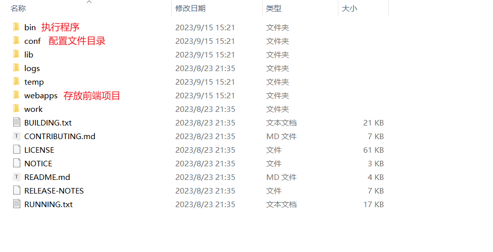
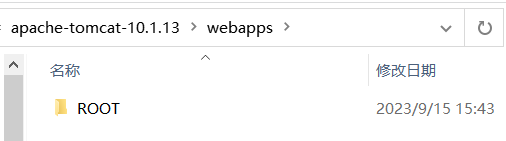

# NLP引擎部署文档


# 环境说明

## 开发环境

| 工具  | 版本    | 备注     |
| ----- | ------- | -------- |
| JDK   | 1.8     | 强制要求 |
| MySQL | 5.7.24+ | 强制要求 |
| Redis | ——      |          |

## 开发使用工具
| 工具  | 说明 |
| ----- | ------- |
| IntelliJ IDEA   | Java编程语言开发的集成环境 |
| Navicat | Mysql数据库管理工具 |
| RedisDesktopManager | Redis可视化管理工具 |

# 部署说明
针对于不同的技术人群，我们提供了多种部署方式：
- 简易版部署：使用Docker只需要一行命令即可完成‘NLP自然语言处理引擎’系统的部署
- 全服务本地化部署：针对于前端、Java后端、Python后端全部实现本地化部署

# 简易版部署
针对于小白用户，为了避免安装各种开发环境的苦恼，我们给出了简易版部署教程，只需要用户安装好Docker，执行一行命令即可部署我们的‘NLP自然语言处理引擎’系统

## Docker安装
在Docker官网也有针对各个操作系统的详细安装步骤：https://www.docker.com/get-started/
- 对于Windows用户

  在docker官网点击Download for Windows下载安装包进行安装，具体的安装教程可以参考互联网资料

  

- 对于Ubuntu用户

  在命令行输入apt install -y docker.io

- 对于Centos用户

  yum install -y docker

- 对于MacOs用户

  brew install --cask --appdir=/Applications docker

安装完在命令行输入 docker -v 可以返回Docker版本号相关信息即为安装成功

## Docker拉取镜像并运行

在命令行输入下面一行命令即可完成镜像的拉取以及运行,拉取镜像大概需要花费5-10分钟。

```
docker run -itd --name nlp_stonedt -p 8866:8866 registry.cn-beijing.aliyuncs.com/stonedt_nlp/nlp_stonedt:1.0.4 /opt/start.sh
```

当输出结果和下面类似就代表拉取成功了，并已经自动运行了。


## 验证是否成功运行

- 使用docker ps命令获取我们运行的容器ID


- 使用docker logs 容器ID -f 查看容器日志（例如 docker logs 79c788da03a7 -f）

  查看日志是否有Run successfully！字样，如果有就是部署成功啦


## 修改接口地址（非必选）

- 说明：此步骤针对于需要部署在Linux服务器需要给多人使用需要进行的操作，对于Windows部署然后自己用的情况下，不需要进行这部操作。

- 原因：我们的项目是前后端分离项目，前端调用的后端接口地址默认为127.0.0.1，而在Linux服务器部署使用需要将后端接口地址改成Linux服务器的局域网IP地址（如果有公网IP地址则可以改成公网IP地址）
- 获取IP地址

  Linux局域网服务器IP地址使用ifconfig即可获取，公网服务器IP地址请咨询服务器购买商。

- 进入容器

  容器ID在上面有获取方式（通过docker ps命令）

  docker exec -it 容器ID /bin/bash

  例如在命令行键入以下命令即可进入容器

  ```
  docker exec -it 79c788da03a7 /bin/bash
  ```


- 输入命令修改地址（将下面的192.168.0.163改成自己的IP地址）

  ```
  sed -i 's/127.0.0.1/192.168.0.163/g' /opt/tomcat/webapps/ROOT/dist/assets/common/public.js
  ```

## 访问系统

打开浏览器，输入网址 `http://IP地址:8866` 即可进入系统
默认用户名:user 默认密码:123456


# 全服务本地化部署

## 环境安装

### 安装Java环境

JDK8 Oracle官方下载地址：https://www.oracle.com/java/technologies/downloads/#java8

window安装JDK8 参见： https://www.cnblogs.com/zhangzhixing/p/12953187.html

Linux安装JDK8 参见： https://www.jianshu.com/p/75f0f34b599d
### 安装MySQL
Mysql5.7安装方式可以参见：https://www.runoob.com/mysql/mysql-install.html
### 安装Redis
- 安装

源码及apt安装

http://www.imxmx.com/Item/1/211097.html

- 配置

关于redis的配置这篇文章说的很详细

https://www.cnblogs.com/ysocean/p/9074787.html

## 启动Python程序

Python部署需要准备至少12GB运行内存

### 一. 部署方式

针对于新手、或有一定基础、或有一定经验，我们准备了三种部署方式：

- Docker镜像（适合新手）

- Dockerfile（有一定基础）

- Conda（有一定经验）

  下方Conda准备工作和Docker准备工作只需要做其一就可以了。

### 二. Conda准备工作

Conda是一个用于管理Python环境和软件包的开源工具。下面是使用conda进行部署的步骤：

#### 1：安装Conda

如果您尚未安装Conda，请按照以下步骤安装：

1. 访问 [Anaconda官方网站](https://www.anaconda.com/products/individual) 下载适用于您操作系统的Anaconda安装程序。
2. 运行安装程序，并按照提示进行安装。

#### 2：创建环境

1. 打开终端

2. 创建一个新的conda环境：

   ```
   conda create --name myenv python=3.9
   其中，`myenv`是您想要给环境取的名字，`python=3.9`指定了使用Python 3.9版本。
   例如 conda create --name nlp_text python=3.9
   ```

3. 在终端执行下面命令进入虚拟环境激活环境：

   ```
    conda activate myenv
   ```

#### 3：更换镜像源

考虑到网络原因，这里建议用户将镜像源切换成国内源。复制下面的命令在conda虚拟环境里运行即可

- 添加conda清华源

```
conda config --add channels      https://mirrors.tuna.tsinghua.edu.cn/anaconda/pkgs/free/

conda config --add channels    https://mirrors.tuna.tsinghua.edu.cn/anaconda/pkgs/main/

conda config --set show_channel_urls yes
```

- 添加Python源

```
pip config set global.index-url https://mirror.baidu.com/pypi/simple/
```


### 三. Docker准备工作

Docker是一种容器化技术，可以将应用程序及其依赖打包成一个可移植的容器。下面是使用Dockerfile进行部署的步骤：

#### 1：安装Docker

如果您尚未安装Docker，请按照以下步骤安装：

1. 访问 [Docker官方网站](https://www.docker.com/) 下载适用于您操作系统的Docker安装程序。
2. 运行安装程序，并按照提示进行安装。


### 四. 功能分类

考虑到功能分类、资源占用和用户需求的多样性，我们将 Python 端拆分为多个项目。根据您的需求，您可以下载相应的 Python 代码并安装其所需的依赖包。

根据当前计划，我们将 Python 项目分为以下几类：

- 文本处理服务（NLPTextService.py）
- 音视频文件处理服务
- 图像处理服务

文本处理服务功能包括：

- 情感分析
- 招标抽取
- 合同抽取
- 法律文书信息抽取
- 简历抽取
- 观点抽取
- 自定义文本抽取
- 时间抽取
- 关系抽取
- 实体抽取
- 机构识别
- 主题抽取
- 相似度查找
- 文本纠错
- 词性标注
### 五. Python部署

#### 1.文本处理服务（NLPTextService.py）

- Conda部署

  - 拉取代码：此服务的代码的位置在：free-nlp-api/Python/Code/NLPTextService.py
  - 进入conda虚拟环境：conda activate myenv

  - 安装paddlepaddle 基础依赖

  ```
  conda install paddlepaddle==2.5.1 --channel https://mirrors.tuna.tsinghua.edu.cn/anaconda/cloud/Paddle/
  ```
  - 安装依赖

  ```
  pip install paddlenlp==2.5.2  synonyms==3.18.0  paddlehub==2.1.0 aiofiles==22.1.0 fastapi  uvicorn  pycorrector==0.4.8 
  ```
  - 下载模型

    对于大部分的功能，在运行python程序的时候会自动从互联网进行下载，但是对于某些服务我们提供了我们自己训练的模型，对结果的精度以及效果都有很大的提升，需要用户手动下载模型放在和Python代码同路径（free-nlp-api/PythonCode）下（当然也可以放到别的路径，需要在代码里修改模型路径地址），uie模型下载地址http://36.138.131.136:8089/open_nlp/uie_modle.tar.gz。下载完模型进行解压即可。

  - 运行程序

    进入本项目本地路径free-nlp-api/PythonCode，执行下面命令完成后台运行

    ```
    nohup python NLPTextService.py &
    ```

- Dockerfile部署

  - 拉取文本处理Dockerfile：此文件的位置在：free-nlp-api/Python/Dockerfile/NLPTextService

  - 或者直接wget下载 ：wget https://gitee.com/stonedtx/free-nlp-api/raw/master/Python/Dockerfile/NLPTextService

  - 将NLPTextService改名成Dockerfile

  - 构建镜像

    在Dockerfile目录下 运行 docker build -t nlp_text:1.0.0 .

  - 构建容器并运行

    docker run -itd --name nlp_text:1.0.0

- Docker部署

  - 拉取docker镜像并运行

    ```
    docker run -itd -p 8801:8801 --name nlp_text registry.cn-beijing.aliyuncs.com/stonedt_nlp/nlp_text:1.0.1
    ```


## 启动后端程序
对于有开发经验 建议使用编译器运行调试和Jar包部署运行
对于小白用户 建议Docker部署

### 配置文件
- 配置文件路径

  配置文件的路径在项目根路径的config文件夹下

  

- 配置文件说明

  application.properties为Python服务端接口配置

  application.yml为Java后端配置,里面包含了Java后端启动端口、MySQL数据库配置信息、Redis配置信息等，用户只需要关注MySQL、Redis配置即可，修改说明在此文件有详细的注释可以参考

### 编译器运行调试

- 使用Git工具或者编译器最新源代码 地址https://gitee.com/stonedtx/free-nlp-api.git

- 使用idea或者eclipse

- 打开项目设置JDK1.8

  

  

- 设置maven地址指向本地maven

  

- 使用navicat或命令行创建数据库free_nlp_data

  

- 选择刚刚创建的数据库，右键选择运行SQL文件进行导入数据库，SQL文件的位置项目的db\V1__create.sql

  

- 打开项目的配置文件application.yml修改数据库和redis的地址、用户名、密码信息

```
# 数据源配置
spring:
  datasource:
    driver-class-name: com.mysql.cj.jdbc.Driver
    url: jdbc:mysql://127.0.0.1:3306/free_nlp_data?characterEncoding=UTF-8&useSSL=false
    username: root
    password: 1234
```

```
spring:
  redis:
    database: 0
    host: 127.0.0.1
    port: 6379
    max-active: 10000
    max-idle: 10
    max-wait: 100000
    timeout: 100000
```

- 等待maven配置好所有的相关依赖就可以点击运行了。


### JAR包运行

- 下载部署文件压缩包：地址为http://36.138.131.136:8089/open_nlp/free-nlp-api.zip 

- 解压压缩包并修改配置文件

  free-nlp-api.jar文件为Java程序包，config目录为配置文件目录，我们需要对配置文件进行修改

  application.yml 为运行所需环境配置信息，我们将数据库信息和redis信息改成自己的。

  application.properties 为调用我们部署的Python端接口地址，更换ip地址为部署Python服务的机器ip地址。

- 在根目录执行 *java -jar free-nlp-api.jar*  启动我们的**NLP自然语言处理引擎**

### Docker运行

#### 安装Docker

#### 拉取基础Docker镜像
- 拉取redis
  $ docker run  -p 6379:6379 --name redis -d redis:7.0.12

  使用命令docker ps 查看是否redis容器

- 拉取Mysql
  $ docker run -itd --name mysql -p 3306:3306 -e MYSQL_ROOT_PASSWORD=1234 mysql:5.7.24

  使用命令docker ps 查看是否mysql 容器

  创建数据库free_nlp_data 字符集utf8mb4 排序规则utf8mb4_general_ci
  在我们的开源地址gitee上找到/db项目路径的sql文件,将数据导入mysql

- 运行后端Docker
  $ docker run -itd --name nlp_data -p 8090:8090  registry.cn-shanghai.aliyuncs.com/stonedt_nlp/nlp_data:1.0.1

  使用命令docker ps 查看是否nlp_data 容器

  访问http://127.0.0.1:8090/api 查看是否返回结果,如果有就说明后端部署成功

## 启动前端程序
- 因为本项目是前后端分离的，所以需要前后端都启动好，才能进行访问
- 前端项目在ROOT文件夹,使用tomcat进行部署
### Tomcat介绍以及安装
- 下载安装tomcat

  官网：[Apache Tomcat® - Apache Tomcat 10 Software Downloads](https://tomcat.apache.org/download-10.cgi)

  按照自己的操作系统下载合适的Linux或者Windows版本,然后进行解压,注意不要含有中文路径
  解压后目录文件如下
  

### 前端部署
#### 项目源代码拷贝
- 前端项目文件在项目更新目录ROOT文件夹
  
  
  
- 将Tomcat根目录里webapps里面的内容全部删除，将项目根目录文件夹ROOT 拷贝到Tomcat根目录下webapps下,结构如图:
  
#### 后端地址修改

- 找到前端接口配置文件/dist/assets/common/public.js
- 将默认的`127.0.0.1:8866`替换成 我们部署的后端地址

#### 前端项目执行
- windows请双击Tomcat根目录—>bin目录—>startup.bat
- Linux用户请在Tomcat根目录—>bin目录 执行./startup.sh

#### 访问页面
- `访问 http://IP地址:8080/dist/assets/page/login/login.html` 出现登录页面即为前端部署成功


# 技术合作&交流

## 联系我们

+ 微信号： javabloger

+ 电话： 13913853100

+ 邮箱： huangyi@stonedt.com

+ 公司官网：[www.stonedt.com](http://www.stonedt.com)

欢迎您在下方留言，或添加微信与我们交流。


扫描微信二维码，获得技术支持 或者 申请您的系统调用配额。


